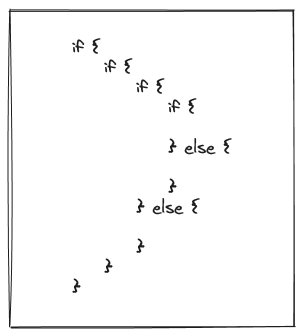

it's all fun and games with if statements until someone have to maintain code like this:



someone that codes like this is one step away of beating old people. if you're a good person and don't want to look like a maniac, please embrace early return. it's not some advanced technique nor require you to read three martin fowler books, it's one of the most easy refactorings and will save you a good amount of sanity.

with early return, instead of going down the rabbit hole of conditionals, you exit the execution wherever a condition isn't met.

let's check a small example:

in the first iteration we have the worst code possible:

```rust
if a {
    if b {
        if c {
            if d {
                // do things
                return;
            } else if e {
                // do things 2
                return;
            } else {
                // do things 3
                return;
            }
        } else {
            // do things 4
            return;
        }
    }
}
```

from here we can start killing else statements:

```rust
if a {
    if b {
        if c {
            if d {
                // do things
                return;
            }

            if e {
                // do things 2
                return;
            }

            // do things 3
            return;
        }
        // do things 4
    }
}
```

after this, we can merge some conditions:

```rust
if a && b {
    if c {
        if d {
            // do things
            return;
        }

        if e {
            // do things 2
            return;
        }

        // do things 3
        return;
    }
    // do things 4
}
```

if we invert `if c`, we can `do things 4` earlier:

```rust
if a && b {
    if !c {
        // do things 4
        return;
    }

    if d {
        // do things
        return;
    }

    if e {
        // do things 2
        return;
    }

    // do things 3
    return;
}
```

all conditions depends on a and b being true, we can also kill another nesting by doing this:

```rust
if !a || !b {
    return;
}

if !c {
    // do things 4
    return;
}

if d {
    // do things
    return;
}

if e {
    // do things 2
    return;
}

// do things 3
return;
```

and that's it! now we have a more readable code to handle.
